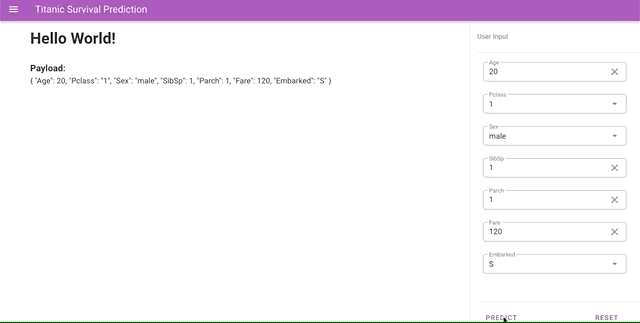

# FastAPI Vue App

Deploy Machine Learning models as API via FastAPI and consume the API from a frontend by Vue.

## Tech Stack

* Backend: FastAPI
* Frontend: Vue


## Get Started

1. prepare virtual environment and install dependencies
```
conda create -n fastapi_vue_app python=3.7
conda activate fastapi_vue_app
pip install -r requirements.txt
``` 
2. train a binary classification model [Optional]

```
# optional, the saved model is already provided in the repo
python train_model.py
```

3. launch the model prediction API
```
uvicorn api:app --reload
```

4. check the vue app at localhost:8000/app


