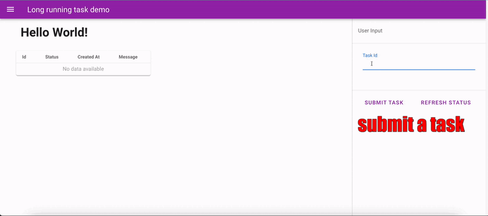

# Example of long-running job app 

API post method is unable to handle tasks that take very long running time. It's better to allow the task running at the background, and then update the progress to end users. 

This is the mini demo to illutrate the idea with `fastapi` and `vue` tech stack.

- `fastapi` as backend server
- `vue3` as frontend ui

# High level explanation

- `api.py` sprawns separte worker processes (`worker.py`), which are responsbile to perform the actual tasks.
- `api.py` acts as orchestrator to communicate the progress of workers with the frontend layer throught APIs.
- the communication is done via `redis`
- in the frontend, a periodic refetch is used to update the status of workers from APIs. This may not be the best/efficient approach, but it's relatively easier to implement.

# Quick Start

1. get the redis and run the docker container as the default port of `6379`

```bash
docker pull redis
```

2. install the packages

```bash
pip install -r requirements.txt
```

3. run the api server

```bash
python api.py # it will automatic start workers using subprocess
```

4. go the ui to test out

ui is running at http://localhost:8000/app

